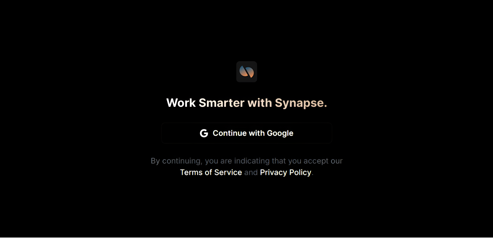
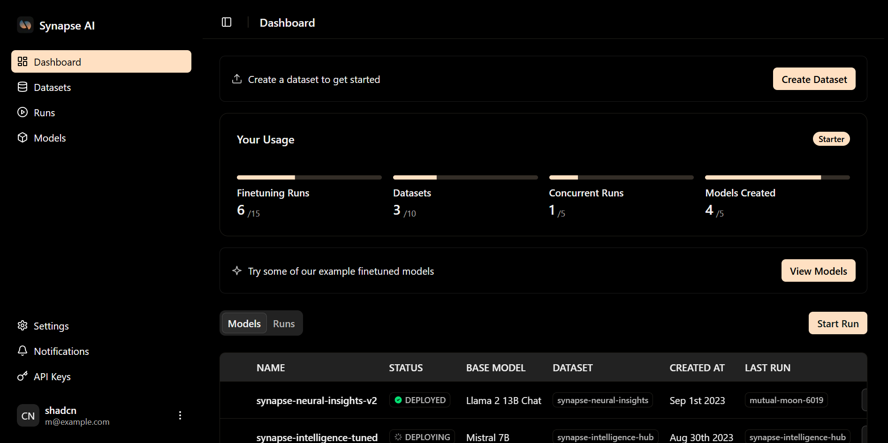

### Step 1: Visit the Website

Visit our website [here](https://synapseai.framer.website/), and click the **Get Started** button on the top right corner.

### Step 2: Continue with Google

You can directly sign in with your Google account by clicking **"Continue with Google"**.

### Step 4: Success!

Congrats! If you made it to this step, you should now see the dashboard and you're ready to begin the next step in building a custom model: **Uploading Data**. 
