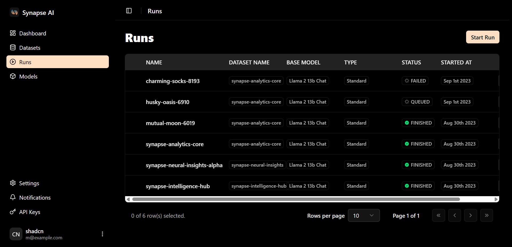
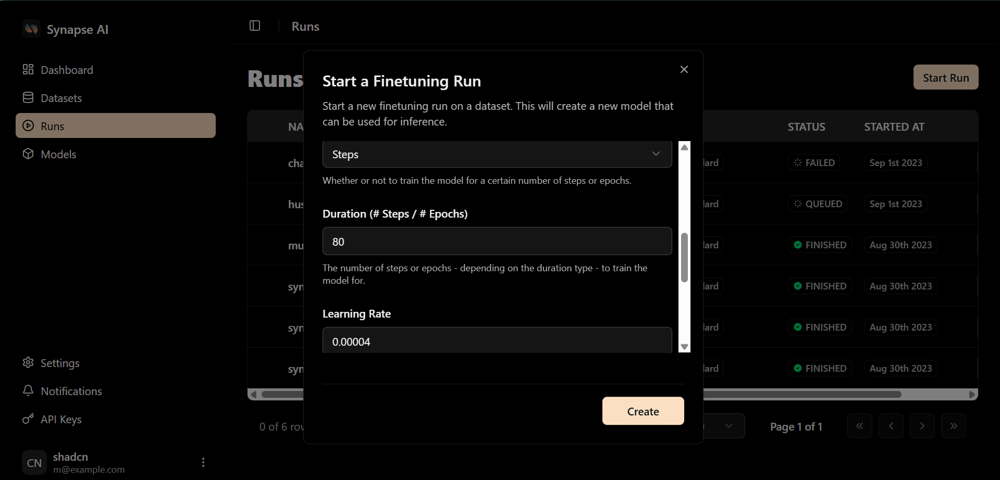

## Initiating a Fine-Tuning Process

From within your dataset, you can select **"Start a Run"** or navigate to the **"Runs"** section and click **"Start Run"** in the upper right corner.

This will present you with several configuration options to launch a fine-tuning process, and within minutes, you'll have your customized model ready.

## Setting Up Your Fine-Tuning Process

### Essential Settings

**Dataset**: Select the dataset you've prepared for training

**Base Model**: At present, we offer support for **Llama 2 13B**. Llama 2 70B and Mistral 7B are currently under development, but if you need them urgently or have a specific open-source model request, please complete this form and we'll respond promptly.

**Duration Type & Duration**: Choose between Steps or Epochs. An epoch represents one complete pass through the data, while 5 epochs means the model processes each data point five times. A step refers to training the model on a small batch of input/output sample pairs.

There isn't a definitive answer for the optimal number of steps or epochs, so it's recommended to select a reasonably high number such as **10 epochs**. During training, monitor your loss curve and consider stopping the run once the graph appears to plateau if it's still in progress.

**Type**: Standard

**System Prompt**: This serves as the system prompt you would typically provide to an LLM in a playground environment.

### Advanced Configuration Settings

**Learning Rate**: Determines the speed at which the model acquires knowledge. A higher learning rate may result in faster training but potentially lower performance. Conversely, a lower learning rate may yield better model performance but require longer training duration.

**Complexity**: A parameter ranging from 0 to 1; higher values train more parameters and require additional time. Increased complexity is recommended for intricate tasks when lower complexity proves insufficient.

## Training Workflow

After adjusting these settings to your preferences, click **"Create"** and observe the model initialization process, which takes approximately 10 seconds.

Once the model completes initialization, the training process commences. You'll be able to monitor the projected completion time and track the current progress.

## Training Completion

When the model finishes training, you'll notice **"finished"** displayed in the top right corner, accompanied by the **"Run Model"** button.

Your customized model is now operational! You can proceed to the following section to discover how to utilize your newly trained model. 