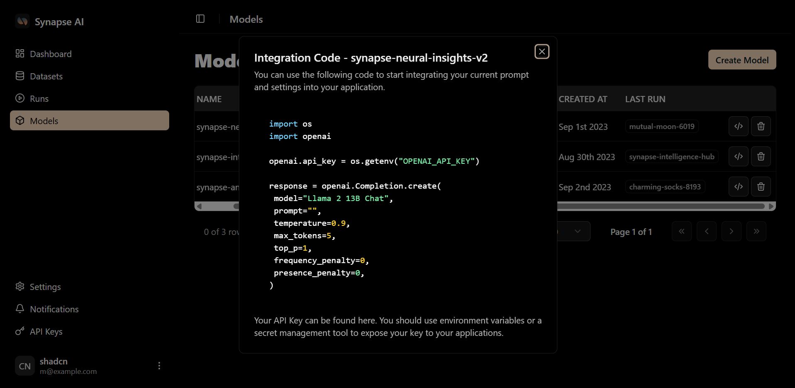

Congratulations! You now have a fine-tuned, custom Synapse AI model.

### Get Your Integration Code

You can get your integration code by clicking on the **"Code Snippet"** icon to start using your custom model in your applications.

### Model Management

If you need to free up space, remove an outdated model, or clean up your workspace, you can delete your model by clicking on the **trash icon** next to the Code Snippet button.

### Need to Retrain?

If you find that you might need to retrain it, go back to the **upload data** page or the **fine-tune** page. 